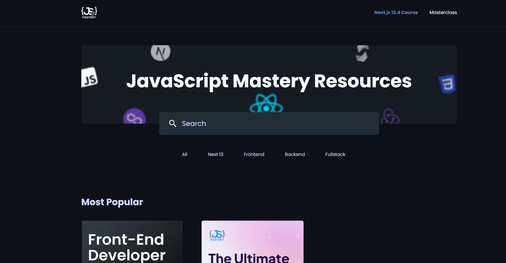

## Installation and Setup



Follow these steps to install and set up the project:

1. **Clone the repository** to your local machine using the following command:
    ```bash
    git clone https://github.com/adrianhajdin/jsm_resources_next13.git
    ```

2. **Navigate to the project directory**:
    ```bash
    cd jsm_resources_next13
    ```

3. **Install the required dependencies**. The project requires Next.js, React, React DOM, Sanity, Styled Components, Tailwind CSS, TypeScript, and various other dependencies. You can install these using `npm` or `yarn`. Here is an example using `npm`:
    ```bash
    npm install
    ```

4. **Run the project**:
    ```bash
    npm run dev
    ```
